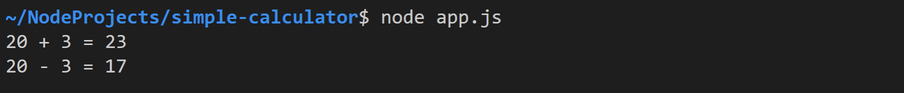
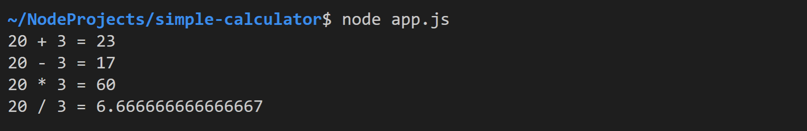
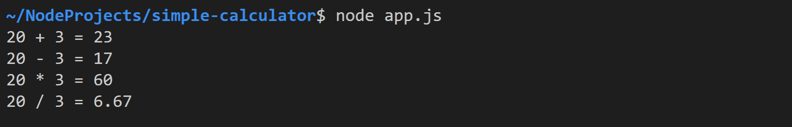

# Simple Calculator

Erstellen die Datei `app.ts` an und entwickeln Sie darin die folgende Applikation.

## Task 1: Add and Subtract

Implementieren Sie die unten dargestellte Funktion `printCalculation`. Dieser werden zwei Parameter übergeben: 

- `operator`: Rechenzeichen für Ausgabe
- `calculate`:  Funktion zur Berechnung des Ergebnisses

`printCalculation` gibt die Rechnung und das Ergebnis für die beiden hartkodierte Zahlen `20` und `3` aus.

``` typescript
function printCalculation(operator: string, calc: (a: number, b: number) => number) {
    console.log("20 " + operator + " 3 = " + calc(20, 3));
}
```

Erstellen Sie nun folgende Funktionen zur Berechnung der Summe bzw. der Differenz zweier Zahlen.

``` typescript
function add(a: number, b: number): number {
    return a + b;
}

function subtract(a: number, b: number): number {
    return a - b;
}
```

Geben Sie am Ende von `app.ts` die Summe und die Differenz von *20* und *3* folgendermaßen aus:

``` javascript
printCalculation("+", add);
printCalculation("-", subtract);
```

Führen Sie die Applikation aus - die Konsolenausgabe sollte folgendermaßen aussehen:



## Task 2: Multiply and Divide

Implementieren Sie die Funktionen `multiply(a, b)` und `divide(a, b)`. Vergessen Sie nicht die Datentypen der Parameter und des Rückgabewerts zu deklarieren. 

Fügen Sie anschließend die entsprechenden Aufrufe von `printCalculation` am Ende von `app.ts` hinzu. In der Konsole sollte die Applikation folgendes ausgeben:



## Task 3: Round Result

Passen Sie die `divide`-Funktion an, sodass das Ergebnis der Division auf 2 Nachkommastellen gerundet wird.


